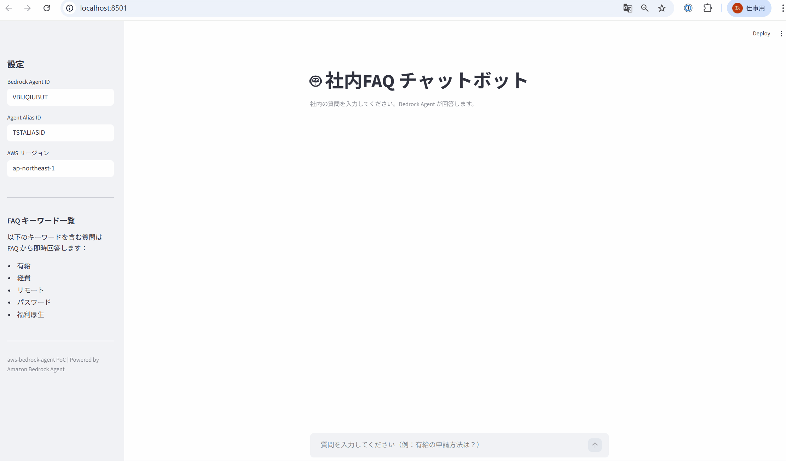
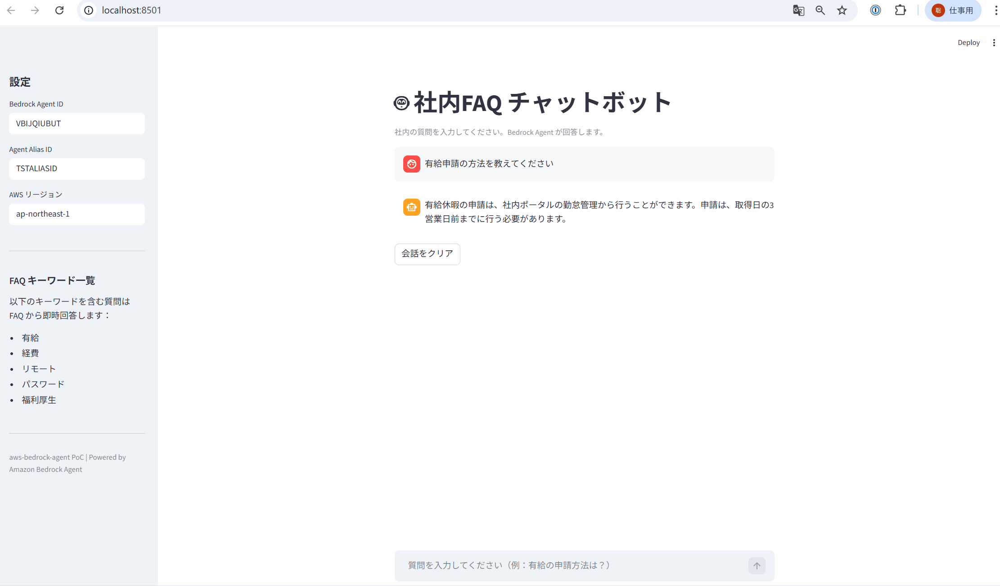
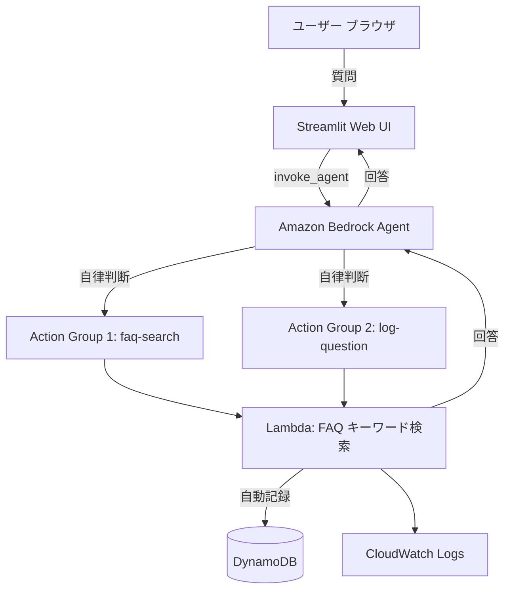
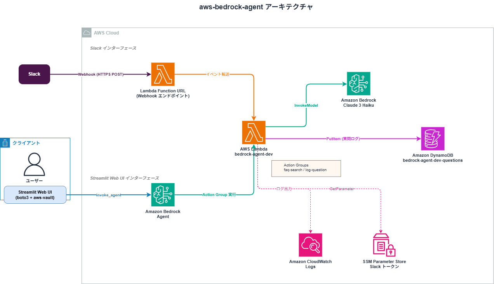
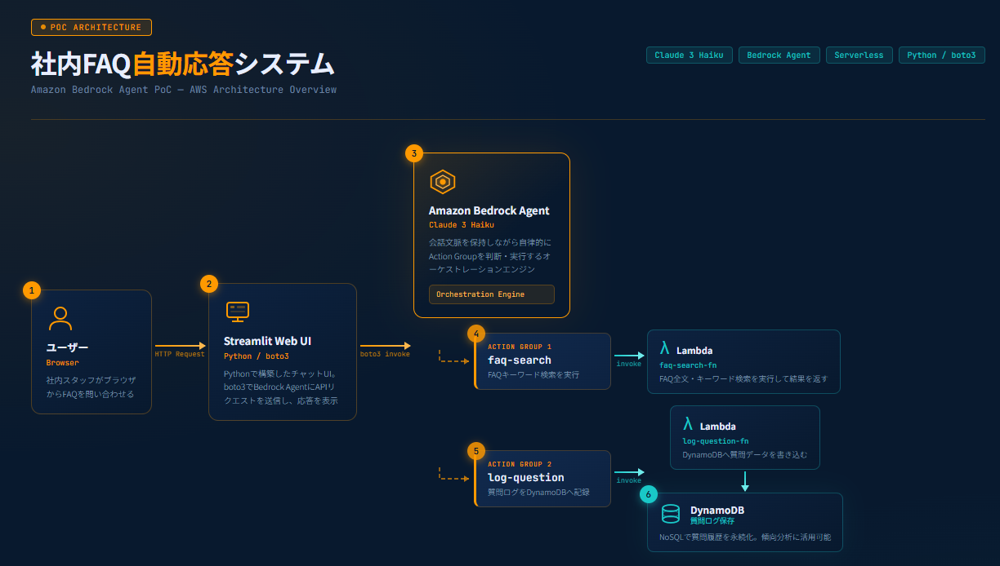
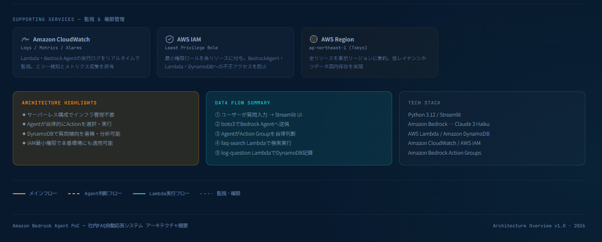

# aws-bedrock-agent


[](https://codecov.io/gh/satoshif1977/aws-bedrock-agent)


社内FAQや業務問い合わせの一次対応を自動化する PoC です。
**Amazon Bedrock Agent** と **Action Groups** を活用し、複数のツールを自律的に使い分けながら回答・記録まで自動化します。

---

## デモ

**有給申請の質問 → Bedrock Agent が即時回答**



**経費精算の質問 → Agent が FAQ を検索して回答**



---

## スクリーンショット

| Streamlit Web UI | Action Groups 構成 |
|---|---|
|  |  |

**DynamoDB への自動記録（質問ログ）**


---

## アーキテクチャ

```
ユーザー（ブラウザ）
  ↓
Streamlit Web UI（boto3）
  ↓
Amazon Bedrock Agent（Claude 3 Haiku）
  ├── Action Group 1: faq-search
  │     └── Lambda → FAQ キーワード検索 → DynamoDB に自動記録
  └── Action Group 2: log-question
        └── Lambda → DynamoDB に明示的に記録
```

### AWS 構成図





### プレゼン用アーキテクチャ図（Claude Design 生成）

| メインフロー | サポートサービス・サマリー |
|---|---|
|  |  |

> Claude Design で生成したインフォグラフィック風の構成図。副業・面談資料としても活用可能。

---

## 想定する社内業務

| 業務 | 現状の課題 | このシステムでの改善 |
|---|---|---|
| 社内FAQ問い合わせ | 担当者が毎回同じ質問に答える | 一次回答を自動化・担当者の工数削減 |
| 新入社員のオンボーディング | ルールや手続きが分散して探しにくい | Web UI で即座に回答 |
| IT ヘルプデスク | 問い合わせが集中して対応が遅れる | よくある質問を自動解決・ログで傾向分析 |

---

## 技術的なポイント・工夫

### Bedrock Agent の自律判断
LLM が「どのツールを使うか」を自律的に判断します。固定ロジックではなく、Agent が状況に応じて Action Group を選択します。

### Lambda 内での原子的処理
FAQ 検索と同時に DynamoDB への記録も Lambda 内で完結させる設計にしています。小さいモデル（Claude 3 Haiku）では複数ツールの連続呼び出しが不安定なケースがあるため、**信頼性を優先して Lambda 側で処理を完結**させています。

### IaC による再現性
Bedrock Agent・Action Groups・DynamoDB・Lambda・IAM をすべて Terraform で管理。コマンド一発で同じ環境を再現できます。

---

## プロジェクト構成

```
aws-bedrock-agent/
├── app/
│   ├── app.py              # Streamlit Web UI（Bedrock Agent Runtime 呼び出し）
│   └── requirements.txt
├── lambda/
│   └── index.py            # Action Group ハンドラー（FAQ検索 + DynamoDB記録）
├── terraform/
│   ├── main.tf             # Bedrock Agent / Action Groups / Lambda / DynamoDB / IAM
│   ├── variables.tf
│   ├── outputs.tf
│   ├── provider.tf
│   └── terraform.tfvars.example
├── docs/
│   ├── architecture.drawio
│   └── screenshots/
└── README.md
```

---

## セットアップ手順

### 1. Terraform でデプロイ

```bash
cd terraform
terraform init
terraform plan
terraform apply
```

デプロイ後、以下が出力されます：

```
bedrock_agent_id    = "XXXXXXXXXX"
dynamodb_table_name = "bedrock-agent-dev-questions"
lambda_function_name = "bedrock-agent-dev"
```

### 2. Streamlit Web UI を起動

```bash
cd app
pip install -r requirements.txt
aws-vault exec <profile> -- streamlit run app.py
```

ブラウザで `http://localhost:8501` が開きます。

---

## FAQ キーワード一覧

| キーワード | 回答内容 |
|---|---|
| 有給 | 有給休暇の申請方法（社内ポータル・3営業日前） |
| 経費 | 経費精算の締め日・提出先 |
| リモート | リモートワークのルール（週3日・事前報告） |
| パスワード | IT ヘルプデスクへの連絡方法 |
| 福利厚生 | 社内ポータルの参照先 |

---

## 推定コスト（月額）

| リソース | 月間想定 | 小計 |
|---|---|---|
| Bedrock Agent 呼び出し | 1,000回 | ~$1.00 |
| Lambda | 1,000回 | ~$0.01 |
| DynamoDB（オンデマンド） | 最小 | ~$0.01 |
| CloudWatch Logs | 最小 | ~$0.01 |
| **合計** | | **~$1〜3/月** |

---

## セキュリティ上の注意点

| 項目 | 対応状況 |
|---|---|
| IAM 最小権限 | Lambda・Bedrock Agent それぞれに専用ロールを付与 |
| DynamoDB アクセス制御 | Lambda ロールに PutItem/GetItem のみ許可 |
| ログの個人情報 | 質問の先頭50文字のみログ出力 |
| Bedrock Agent 権限 | 特定モデル ARN に限定したポリシーを適用 |

---

## 今後の拡張ポイント

| 拡張項目 | 内容 |
|---|---|
| Knowledge Base 連携 | Bedrock Knowledge Bases で社内ドキュメントを RAG 検索 |
| Slack 連携 | Webhook 受け口を追加するだけで対応可能 |
| AgentCore Policy | ツール呼び出しに細粒度アクセス制御を追加 |
| 未回答分析 | DynamoDB のログから未回答パターンを可視化 |
| Cognito 認証 | Web UI にログイン機能を追加 |

---

## 後片付け

```bash
cd terraform
terraform destroy
```

---

*このプロジェクトは学習・PoC 目的で作成しました。本番導入時は認証強化・監視・エラー通知の追加が必要です。*

---

## CI / セキュリティスキャン

GitHub Actions で Python リント（flake8）と Terraform の静的解析（Checkov）を自動実行しています。

### 実施内容

| ジョブ | 内容 |
|---|---|
| Python lint（flake8） | コードスタイル・構文エラーの検出 |
| terraform fmt / validate | フォーマット・構文チェック |
| Checkov セキュリティスキャン | IaC のセキュリティポリシー違反を検出（soft_fail: false） |

### セキュリティ対応（Terraform で修正した内容）

| リソース | 追加設定 |
|---|---|
| Lambda | `tracing_config { mode = "PassThrough" }`（X-Ray 有効化） |
| DynamoDB | PITR（Point-in-Time Recovery）・`deletion_protection_enabled = true` |
| IAM（Bedrock ポリシー） | `Resource = "*"` → 特定モデル ARN に限定 |
| CloudWatch Logs | 保持期間のデフォルトを 30 日に設定 |

### 意図的にスキップしている項目（PoC の合理的な省略）

| チェック ID | 内容 | 理由 |
|---|---|---|
| CKV_AWS_117 | Lambda VPC 内配置 | Slack Webhook 受け口として公開構成が必要 |
| CKV_AWS_272 | Lambda コード署名 | dev/PoC では不要 |
| CKV_AWS_116 | Lambda DLQ 設定 | dev/PoC では不要 |
| CKV_AWS_115 | Lambda 予約済み同時実行 | dev/PoC では不要 |
| CKV_AWS_119 | DynamoDB KMS CMK | AWS 管理キーで十分 |
| CKV_AWS_173 | Lambda 環境変数 KMS | dev/PoC では不要 |
| CKV_AWS_158 | CloudWatch Logs KMS | dev/PoC では不要 |
| CKV_AWS_338 | CloudWatch Logs 保持期間 1 年未満 | dev は 30 日で十分 |
| CKV_AWS_290 / CKV_AWS_355 | Bedrock Agent CMK / Guardrails 未設定 | PoC のため省略 |
| CKV_AWS_111 / CKV_AWS_356（インライン） | KMS Decrypt Resource `"*"` | SSM managed key ARN は apply 前に確定不可 |
| Lambda URL AuthType NONE | Lambda Function URL 公開 | Slack Webhook 受け口として必要（署名検証は Lambda 内で実施） |

---

## AI 活用について

本プロジェクトは以下の Anthropic ツールを活用して開発しています。

| ツール | 用途 |
|---|---|
| **Claude Code** | インフラ設計・コード生成・デバッグ・コードレビュー。コミットまで一貫してサポート |
| **Claude Cowork** | 技術調査・設計相談・ドキュメント作成を日常的に活用。AI との協働を業務フローに組み込んでいる |
| **カスタム Skills** | Terraform / Python / AWS に特化した Skills を設定・継続的に更新。自分の技術スタックに最適化したワークフローを構築 |

> AI を「使う」だけでなく、自分の業務・技術スタックに合わせて**設定・運用・改善し続ける**ことを意識しています。
