# aws-bedrock-agent


社内FAQや業務問い合わせの一次対応を自動化する PoC です。
**Amazon Bedrock Agent** と **Action Groups** を活用し、複数のツールを自律的に使い分けながら回答・記録まで自動化します。

---

## デモ

**有給申請の質問 → Bedrock Agent が即時回答**

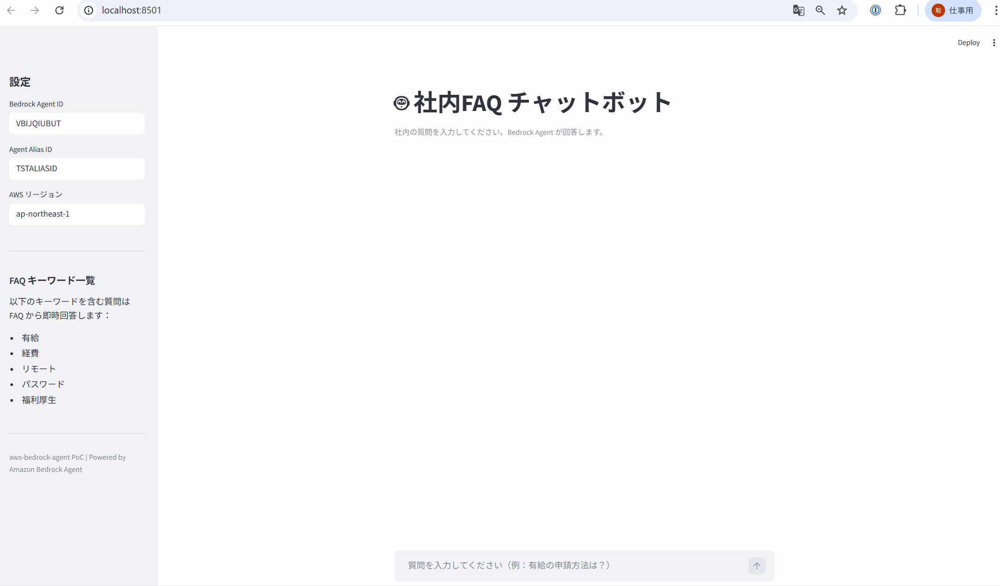

**経費精算の質問 → Agent が FAQ を検索して回答**

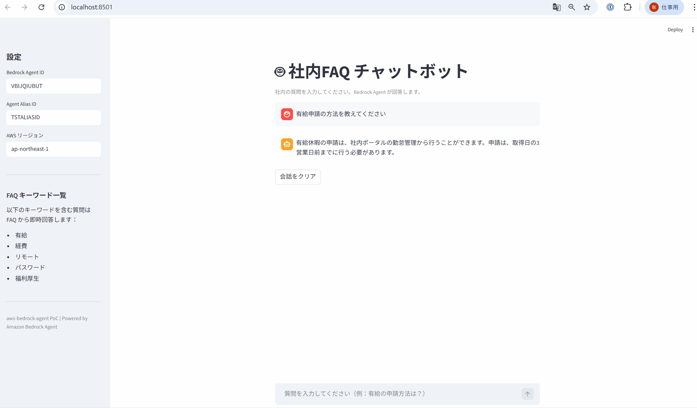

---

## スクリーンショット

| Streamlit Web UI | Action Groups 構成 |
|---|---|
| 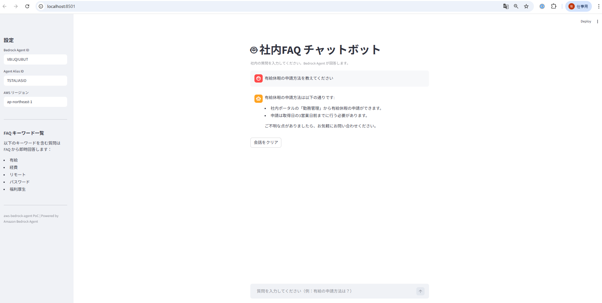 | 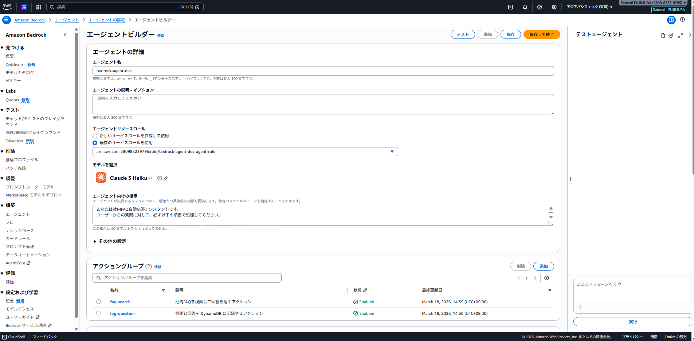 |

**DynamoDB への自動記録（質問ログ）**

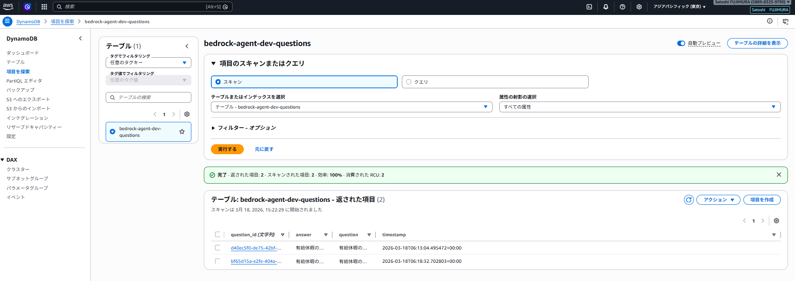

---

### FAQ DynamoDB 外出し（v1.1.0 〜）

FAQ データをコードから切り離し、DynamoDB テーブルで管理する構成に変更しました。Lambda はコールドスタート時に一度だけ Scan し、以降はモジュールレベルキャッシュで高速応答します。

| DynamoDB テーブル一覧 | FAQ アイテム（5件） |
|---|---|
| 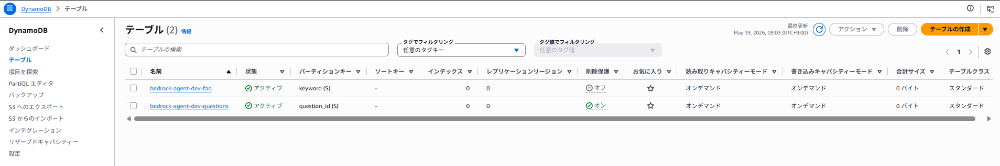 | 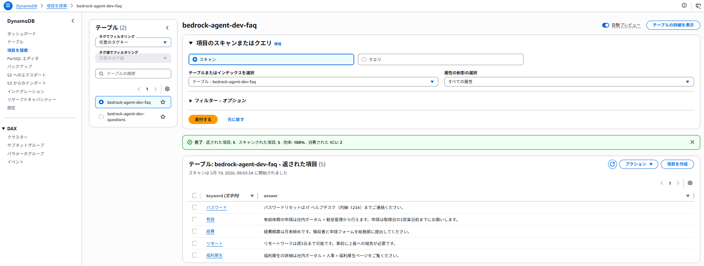 |

| Lambda 環境変数（FAQ_TABLE） | CloudWatch Logs（キャッシュ構築ログ） |
|---|---|
| 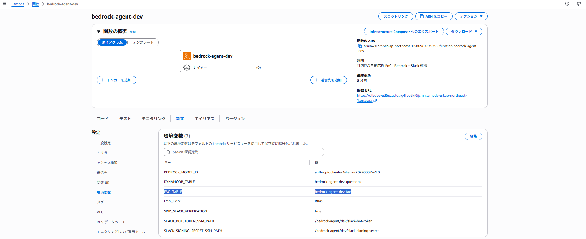 | 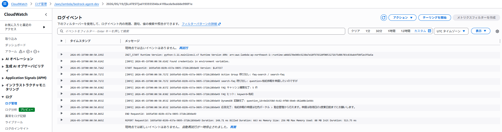 |

> **ポイント**: FAQ の追加・変更はコードのデプロイ不要。DynamoDB のアイテムを更新するだけで即時反映されます（次回コールドスタート時に再読み込み）。

---

## アーキテクチャ

```
ユーザー（ブラウザ）
  ↓
Streamlit Web UI（boto3）
  ↓
Amazon Bedrock Agent（Claude 3 Haiku）
  ├── Action Group 1: faq-search
  │     └── Lambda → FAQ キーワード検索 → DynamoDB に自動記録
  └── Action Group 2: log-question
        └── Lambda → DynamoDB に明示的に記録
```

### AWS 構成図

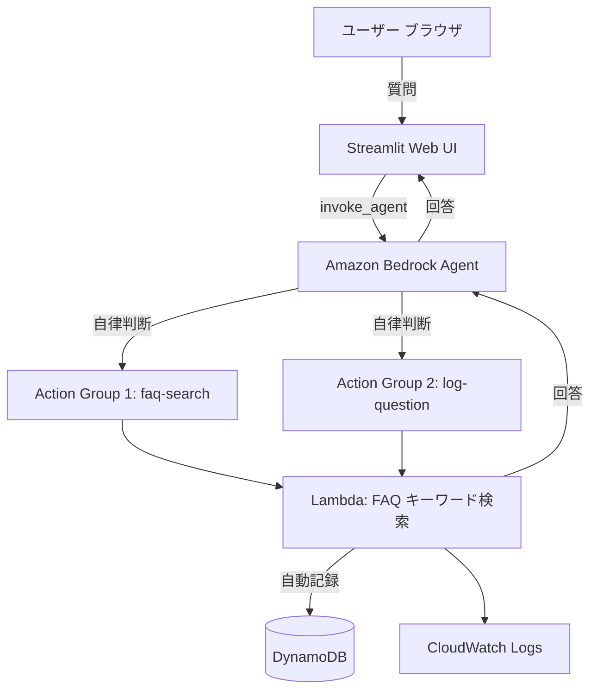
```mermaid
graph TD
    A[ユーザー ブラウザ] -->|質問| B[Streamlit Web UI]
    B -->|invoke_agent| C[Amazon Bedrock Agent]
    C -->|自律判断| D[Action Group 1: faq-search]
    C -->|自律判断| E[Action Group 2: log-question]
    D --> F[Lambda: FAQ キーワード検索]
    E --> F
    F -->|回答| C
    F -->|自動記録| G[(DynamoDB)]
    C -->|回答| B
    F --> H[CloudWatch Logs]
```

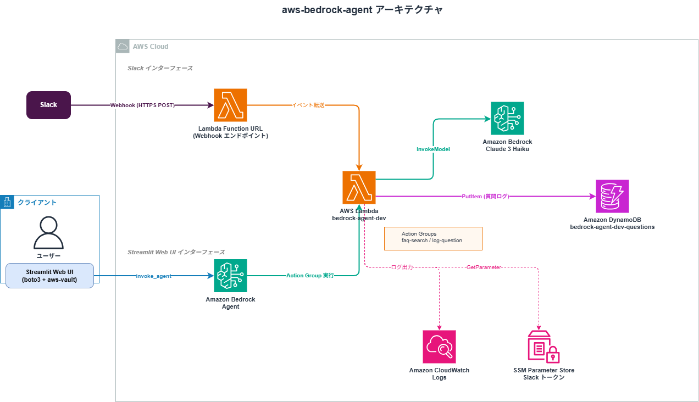

### プレゼン用アーキテクチャ図（Claude Design 生成）

| メインフロー | サポートサービス・サマリー |
|---|---|
| 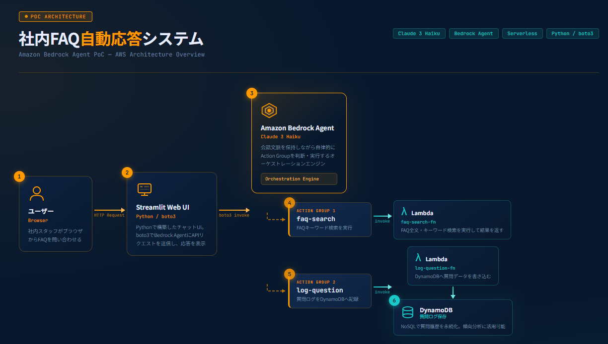 | 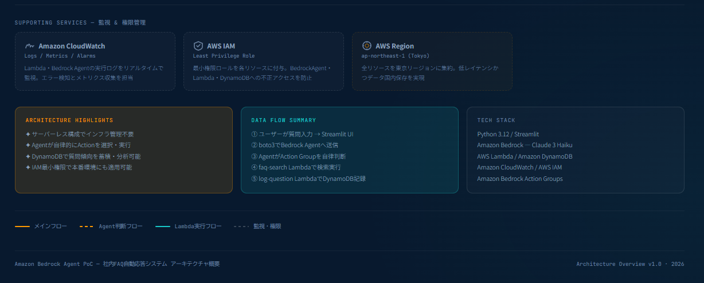 |

> Claude Design で生成したインフォグラフィック風の構成図。プレゼン・ポートフォリオ資料としても活用可能。

---

## 想定する社内業務

| 業務 | 現状の課題 | このシステムでの改善 |
|---|---|---|
| 社内FAQ問い合わせ | 担当者が毎回同じ質問に答える | 一次回答を自動化・担当者の工数削減 |
| 新入社員のオンボーディング | ルールや手続きが分散して探しにくい | Web UI で即座に回答 |
| IT ヘルプデスク | 問い合わせが集中して対応が遅れる | よくある質問を自動解決・ログで傾向分析 |

---

## Bedrock Guardrails（v1.2.0 〜）

社内FAQ ボットに不適切なコンテンツや機密情報の漏洩を防ぐガードレールを追加しました。

### 設定内容

| 機能 | 設定 | 効果 |
|---|---|---|
| コンテンツフィルター | HATE / INSULTS / SEXUAL / VIOLENCE を HIGH でブロック | 有害な入出力を自動遮断 |
| 禁止トピック | 法的アドバイス・他人の給与情報・競合他社情報 | FAQ 範囲外の質問を拒否 |
| PII マスキング | 氏名・メール・電話番号・住所を匿名化（ANONYMIZE） | 個人情報の意図しない漏洩を防止 |
| ワードフィルター | パスワード・秘密鍵・アクセスキーなどを遮断 | 機密キーワードを自動検出 |

### アーキテクチャへの追加

```
ユーザー入力
  ↓
[Bedrock Guardrail] ← 禁止トピック・有害コンテンツ・PII をチェック
  ↓（通過した場合のみ）
Amazon Bedrock Agent（Claude 3.5 Haiku）
  ↓
[Bedrock Guardrail] ← 出力にも同じフィルターを適用
  ↓
ユーザーへの回答
```

### 面談ポイント

- **エンタープライズ必須機能**: 金融・医療・人事系の Bedrock 活用では Guardrails は実質必須
- **コスト**: テキスト 1,000 単位あたり約 $0.15（検証レベルはほぼ $0）
- **Lambda 不要**: Agent に `guardrail_configuration` を追加するだけで有効化。コード変更なし
- **PII 匿名化**: `BLOCK`（拒否）ではなく `ANONYMIZE`（マスク）を選択することでユーザー体験を損なわず保護

---

## 技術的なポイント・工夫

### Bedrock Agent の自律判断
LLM が「どのツールを使うか」を自律的に判断します。固定ロジックではなく、Agent が状況に応じて Action Group を選択します。

### Lambda 内での原子的処理
FAQ 検索と同時に DynamoDB への記録も Lambda 内で完結させる設計にしています。小さいモデル（Claude 3 Haiku）では複数ツールの連続呼び出しが不安定なケースがあるため、**信頼性を優先して Lambda 側で処理を完結**させています。

### IaC による再現性
Bedrock Agent・Action Groups・DynamoDB・Lambda・IAM をすべて Terraform で管理。コマンド一発で同じ環境を再現できます。

---

## プロジェクト構成

```
aws-bedrock-agent/
├── app/
│   ├── app.py              # Streamlit Web UI（Bedrock Agent Runtime 呼び出し）
│   └── requirements.txt
├── lambda/
│   └── index.py            # Action Group ハンドラー（FAQ検索 + DynamoDB記録）
├── terraform/
│   ├── main.tf             # Bedrock Agent / Action Groups / Lambda / DynamoDB / IAM
│   ├── variables.tf
│   ├── outputs.tf
│   ├── provider.tf
│   └── terraform.tfvars.example
├── scripts/
│   └── seed_faq.py         # FAQ 初期データ投入スクリプト（terraform apply 後に1回実行）
├── docs/
│   ├── architecture.drawio
│   └── screenshots/
└── README.md
```

---

## セットアップ手順

### 1. Terraform でデプロイ

```bash
cd terraform
terraform init
terraform plan
terraform apply
```

デプロイ後、以下が出力されます：

```
bedrock_agent_id    = "XXXXXXXXXX"
dynamodb_table_name = "bedrock-agent-dev-questions"
lambda_function_name = "bedrock-agent-dev"
```

### 2. FAQ データを DynamoDB に投入

```bash
# terraform apply 後に一度だけ実行
aws-vault exec personal-dev-source -- python scripts/seed_faq.py
# → FAQ キーワード 5件（有給・経費・リモート・パスワード・福利厚生）を登録
```

### 3. Streamlit Web UI を起動

```bash
cd app
pip install -r requirements.txt
aws-vault exec <profile> -- streamlit run app.py
```

ブラウザで `http://localhost:8501` が開きます。

---

## FAQ キーワード一覧

| キーワード | 回答内容 |
|---|---|
| 有給 | 有給休暇の申請方法（社内ポータル・3営業日前） |
| 経費 | 経費精算の締め日・提出先 |
| リモート | リモートワークのルール（週3日・事前報告） |
| パスワード | IT ヘルプデスクへの連絡方法 |
| 福利厚生 | 社内ポータルの参照先 |

---

## Action Group の追加方法

既存の2つの Action Group に加え、新しいツールを Agent に追加する手順です。

### 1. Lambda ハンドラーに新ルートを追加

`lambda/index.py` の `routes` 辞書に追加します：

```python
# lambda/index.py
routes = {
    "search-faq":    _search_faq,
    "log-question":  _log_question,
    "check-status":  _check_status,   # ← 追加
}
```

新しい関数 `_check_status()` を同ファイルに実装し、`return` 値は既存の `_search_faq` と同じ形式（`{"response": {"actionGroup": ..., "apiPath": ..., "responseBody": ...}}`）に合わせます。

### 2. Terraform に Action Group ブロックを追加

`terraform/main.tf` の `aws_bedrockagent_agent` リソースに追加します：

```hcl
action_group {
  action_group_name = "check-status"
  description       = "各種申請の処理状況を確認する"
  action_group_executor {
    lambda = aws_lambda_function.agent.arn
  }
  api_schema {
    payload = jsonencode({
      openapi = "3.0.0"
      info    = { title = "check-status", version = "1.0.0" }
      paths = {
        "/check" = {
          get = {
            operationId = "checkStatus"
            parameters  = [{ name = "type", in = "query", required = true, schema = { type = "string" } }]
            responses   = { "200" = { description = "OK" } }
          }
        }
      }
    })
  }
}
```

### 3. 追加後の注意点

| 注意点 | 詳細 |
|---|---|
| Agent の再 PREPARE | Action Group 変更後は Agent を PREPARE 状態にする必要あり（`auto_prepare = true` で自動化済み） |
| `operationId` の一致 | OpenAPI スキーマの `operationId` と Lambda の `apiPath` が完全一致しないと Agent がツールを認識しない |
| エイリアスの更新 | Action Group 変更後は Alias を再作成または更新しないと呼び出し元に反映されない |

### Lambda の単体テスト（Action Group 追加後の確認）

```bash
# Action Group ハンドラーを直接 Invoke して動作確認
aws-vault exec personal-dev-source -- aws lambda invoke \
  --function-name bedrock-agent-dev \
  --payload '{"actionGroup":"check-status","apiPath":"/check","httpMethod":"GET","parameters":[{"name":"type","type":"string","value":"有給"}]}' \
  response.json
cat response.json
```

---

## 推定コスト（月額）

| リソース | 月間想定 | 小計 |
|---|---|---|
| Bedrock Agent 呼び出し | 1,000回 | ~$1.00 |
| Lambda | 1,000回 | ~$0.01 |
| DynamoDB（オンデマンド） | 最小 | ~$0.01 |
| CloudWatch Logs | 最小 | ~$0.01 |
| **合計** | | **~$1〜3/月** |

---

## セキュリティ上の注意点

| 項目 | 対応状況 |
|---|---|
| IAM 最小権限 | Lambda・Bedrock Agent それぞれに専用ロールを付与 |
| DynamoDB アクセス制御 | Lambda ロールに PutItem/GetItem のみ許可 |
| ログの個人情報 | 質問の先頭50文字のみログ出力 |
| Bedrock Agent 権限 | 特定モデル ARN に限定したポリシーを適用 |

---

## 今後の拡張ポイント

| 拡張項目 | 内容 |
|---|---|
| Knowledge Base 連携 | Bedrock Knowledge Bases で社内ドキュメントを RAG 検索 |
| Slack 連携 | Webhook 受け口を追加するだけで対応可能 |
| AgentCore Policy | ツール呼び出しに細粒度アクセス制御を追加 |
| 未回答分析 | DynamoDB のログから未回答パターンを可視化 |
| Cognito 認証 | Web UI にログイン機能を追加 |

---

## 後片付け

```bash
cd terraform
terraform destroy
```

---

## 学習で気づいたこと・躓いたポイント

### Bedrock Agent

- **Agent エイリアスを作成しないと呼び出せない**: `invoke_agent` は Agent ID ではなく **Agent Alias ID** が必要。コンソールで Agent を作成しただけではエイリアスが存在しないため、必ずエイリアスを作成してから Terraform の outputs に反映する。
- **Action Group の Lambda スキーマの厳密さ**: OpenAPI スキーマの `operationId` と Lambda の `apiPath` が一致していないと Agent がツールを認識しない。小さなスペル差異でサイレントに失敗するので注意。
- **Claude 3 Haiku は複数ツールの連続呼び出しが不安定**: 大きいモデルなら Agent が複数ツールを順番に呼び出せるが、Haiku では途中で止まることがある。FAQ 検索と DynamoDB 記録を 1 つの Lambda にまとめて**信頼性を優先**した設計に変更して解決。

### Terraform / DynamoDB

- **DynamoDB クライアントのリージョン指定**: `boto3.client('dynamodb')` はデフォルトで `AWS_DEFAULT_REGION` 環境変数を参照するが、Lambda 環境では明示的に `region_name` を渡すか環境変数を設定する方が確実。ハードコードは避ける。

---

*このプロジェクトは学習・PoC 目的で作成しました。本番導入時は認証強化・監視・エラー通知の追加が必要です。*

---

## トラブルシューティング

| 症状 | 原因 | 対処法 |
|---|---|---|
| `ResourceNotFoundException: Agent alias` | Alias が未作成 | コンソールで Agent Alias を作成し、Alias ID を `terraform.tfvars` に設定する |
| Action Group が呼び出されない | OpenAPI スキーマの `operationId` と Lambda のパスが不一致 | スキーマの `operationId` と `apiPath` が完全一致するか確認 |
| Streamlit で `NoCredentialsError` | aws-vault を経由していない | `aws-vault exec <profile> -- streamlit run app.py` で起動する |
| DynamoDB `AccessDeniedException` | Lambda IAM ロールに PutItem 権限がない | `terraform plan` で IAM ポリシーを確認・再 apply |
| Bedrock から `ValidationException` | モデルアクセスが未許可 | AWS コンソール → Bedrock → モデルアクセスで Claude を有効化 |

---

## ローカル開発・テスト方法

### Streamlit Web UI のローカル起動

```bash
cd app
pip install -r requirements.txt
aws-vault exec personal-dev-source -- streamlit run app.py
# http://localhost:8501 でアクセス
```

### Lambda 関数の単体テスト（CLI）

```bash
# terraform apply 後に実行
aws-vault exec personal-dev-source -- aws lambda invoke \
  --function-name bedrock-agent-dev \
  --payload '{"actionGroup":"faq-search","apiPath":"/search","httpMethod":"GET","parameters":[{"name":"query","type":"string","value":"有給"}]}' \
  response.json
cat response.json
```

### DynamoDB の質問ログ確認

```bash
aws-vault exec personal-dev-source -- aws dynamodb scan \
  --table-name bedrock-agent-dev-questions
```

---

## CI / セキュリティスキャン

GitHub Actions で Python リント（flake8）と Terraform の静的解析（Checkov）を自動実行しています。

### 実施内容

| ジョブ | 内容 |
|---|---|
| Python lint（flake8） | コードスタイル・構文エラーの検出 |
| terraform fmt / validate | フォーマット・構文チェック |
| Checkov セキュリティスキャン | IaC のセキュリティポリシー違反を検出（soft_fail: false） |

### セキュリティ対応（Terraform で修正した内容）

| リソース | 追加設定 |
|---|---|
| Lambda | `tracing_config { mode = "PassThrough" }`（X-Ray 有効化） |
| DynamoDB | PITR（Point-in-Time Recovery）・`deletion_protection_enabled = true` |
| IAM（Bedrock ポリシー） | `Resource = "*"` → 特定モデル ARN に限定 |
| CloudWatch Logs | 保持期間のデフォルトを 30 日に設定 |

### 意図的にスキップしている項目（PoC の合理的な省略）

| チェック ID | 内容 | 理由 |
|---|---|---|
| CKV_AWS_117 | Lambda VPC 内配置 | Slack Webhook 受け口として公開構成が必要 |
| CKV_AWS_272 | Lambda コード署名 | dev/PoC では不要 |
| CKV_AWS_116 | Lambda DLQ 設定 | dev/PoC では不要 |
| CKV_AWS_115 | Lambda 予約済み同時実行 | dev/PoC では不要 |
| CKV_AWS_119 | DynamoDB KMS CMK | AWS 管理キーで十分 |
| CKV_AWS_173 | Lambda 環境変数 KMS | dev/PoC では不要 |
| CKV_AWS_158 | CloudWatch Logs KMS | dev/PoC では不要 |
| CKV_AWS_338 | CloudWatch Logs 保持期間 1 年未満 | dev は 30 日で十分 |
| CKV_AWS_290 / CKV_AWS_355 | Bedrock Agent CMK / Guardrails 未設定 | PoC のため省略 |
| CKV_AWS_111 / CKV_AWS_356（インライン） | KMS Decrypt Resource `"*"` | SSM managed key ARN は apply 前に確定不可 |
| Lambda URL AuthType NONE | Lambda Function URL 公開 | Slack Webhook 受け口として必要（署名検証は Lambda 内で実施） |

---

## AI 活用について

本プロジェクトは以下の Anthropic ツールを活用して開発しています。

| ツール | 用途 |
|---|---|
| **Claude Code** | インフラ設計・コード生成・デバッグ・コードレビュー。コミットまで一貫してサポート |
| **Claude Cowork** | 技術調査・設計相談・ドキュメント作成を日常的に活用。AI との協働を業務フローに組み込んでいる |
| **カスタム Skills** | Terraform / Python / AWS に特化した Skills を設定・継続的に更新。自分の技術スタックに最適化したワークフローを構築 |

> AI を「使う」だけでなく、自分の業務・技術スタックに合わせて**設定・運用・改善し続ける**ことを意識しています。

## Security

See [SECURITY.md](SECURITY.md) for vulnerability reporting and security policies.
